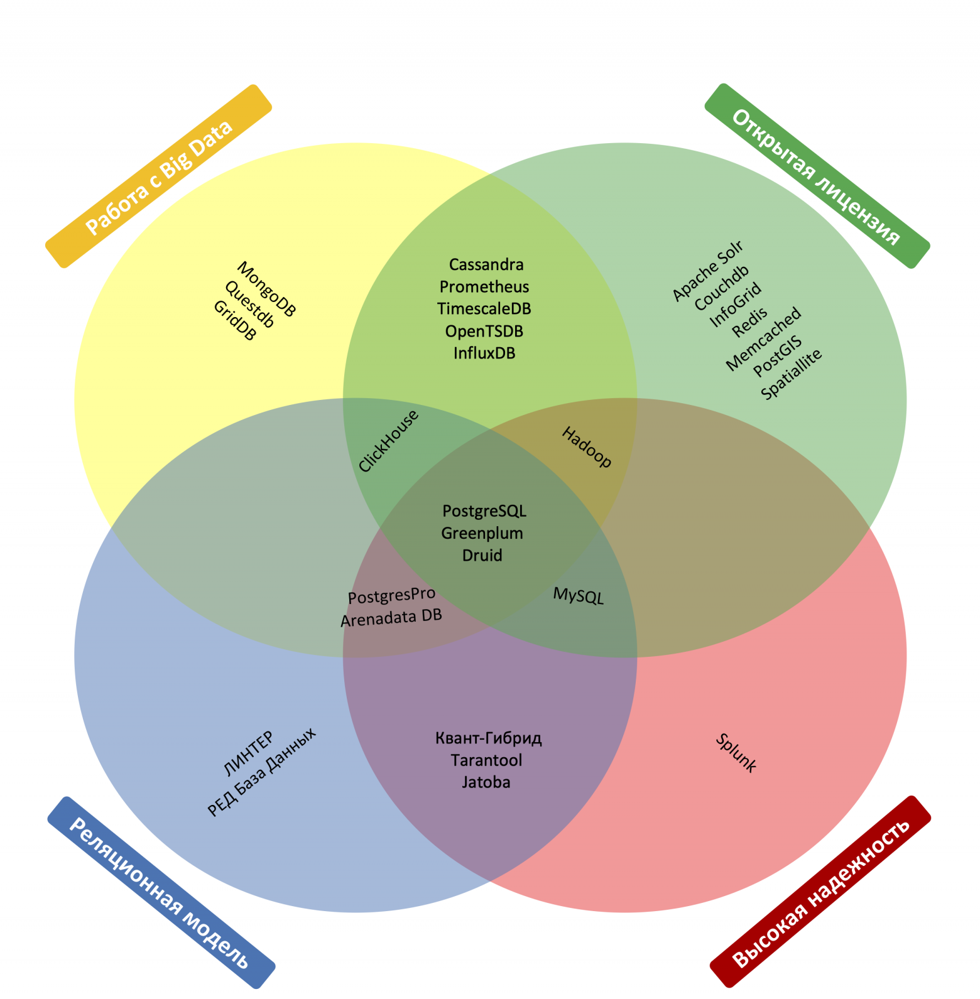

# Домашнее задание к занятию «Базы данных, их типы»

### Задание 1. СУБД

### Кейс
Крупная строительная компания, которая также занимается проектированием и девелопментом, решила создать правильную архитектуру для работы с данными. Ниже представлены задачи, которые необходимо решить для каждой предметной области. 

Какие типы СУБД, на ваш взгляд, лучше всего подойдут для решения этих задач и почему? 
 
1.1. Бюджетирование проектов с дальнейшим формированием финансовых аналитических отчётов и прогнозирования рисков.
СУБД должна гарантировать целостность и чёткую структуру данных.

> Реляционная СУБД *PostgreSQL*

1.1.* Хеширование стало занимать длительно время, какое API можно использовать для ускорения работы? 

1.2. Под каждый девелоперский проект создаётся отдельный лендинг, и все данные по лидам стекаются в CRM к маркетологам и менеджерам по продажам. Какой тип СУБД лучше использовать для лендингов и для CRM? 
СУБД должны быть гибкими и быстрыми.

> Гибкость и быстроту предоставяляют Документооринтированная СУБД, например *MongoDB* (Самые известные — CouchDB, MongoDB, Amazon DocumentDB.)

1.2.* Можно ли эту задачу закрыть одной СУБД? И если да, то какой именно СУБД и какой реализацией?

1.3. Отдел контроля качества решил создать базу по корпоративным нормам и правилам, обучающему материалу и так далее, сформированную согласно структуре компании. СУБД должна иметь простую и понятную структуру.

> Документооринтированная СУБД, например *MongoDB* (Самые известные — CouchDB, MongoDB, Amazon DocumentDB.)

1.3.* Можно ли под эту задачу использовать уже существующую СУБД из задач выше и если да, то как лучше это реализовать?

1.4. Департамент логистики нуждается в решении задач по быстрому формированию маршрутов доставки материалов по объектам и распределению курьеров по маршрутам с доставкой документов. СУБД должна уметь быстро работать со связями.

> Графовая база данных – это систематический набор данных, в котором подчеркиваются взаимосвязи между различными сущностями данных. База данных NoSQL использует математическую теорию графов для отображения связей с данными. В отличие от реляционных баз данных, которые хранят данные в жестких табличных структурах, графовые базы данных хранят данные в виде сети сущностей и отношений. В результате такие базы данных часто обеспечивают более высокую производительность и гибкость, поскольку лучше подходят для моделирования реальных сценариев. Самые известные графовые СУБД — Neo4j, Amazon Neptune, InfiniteGraph, InfoGrid.

1.4.* Можно ли к этой СУБД подключить отдел закупок или для них лучше сформировать свою СУБД в связке с СУБД логистов?

1.5.* Можно ли все перечисленные выше задачи решить, используя одну СУБД? Если да, то какую именно?

*Приведите ответ в свободной форме.*

---

### Задание 2. Транзакции

2.1. Пользователь пополняет баланс счёта телефона, распишите пошагово, какие действия должны произойти для того, чтобы транзакция завершилась успешно. Ориентируйтесь на шесть действий.

> Ответ

1. Пользователь вводит номер телефона в платежном приложении (успешно авторизованный)
2. Платежное приложение определяем по номеру телефона оператора связи и отправляет ему номер телефона. Оператор проверяет номер на существование и выдает ответ о возможности приняия платежа
3. Пользователь вводит сумму и отправляет платеж
4. Оператор связи, получив платеж, проверяет его параметры выдает ответ платежному сервису, что сумма получена 
5. Оператор связи зачисляет платеж на ЛС счет клиента
6. Оператор связи отправляет уведомление платежному сервису, что сумма зачислена
7. Платежный сервис подтвердил клиенту списание суммы в пополнение счета телефона 

2.1.* Какие действия должны произойти, если пополнение счёта телефона происходило бы через автоплатёж?

*Приведите ответ в свободной форме.*

---

### Задание 3. SQL vs NoSQL

3.1. Напишите пять преимуществ SQL-систем по отношению к NoSQL. 

> Ответ

   1. Базы данных SQL просты в использовании. Даже люди, не имеющие опыта работы с базами данных, могут научиться использовать базы данных SQL, пройдя небольшое обучение.
   2. Они очень универсальны и могут использоваться для любых целей - от небольших персональных до крупных корпоративных баз данных, нуждающихся в хранении данных.
   3. Базы данных SQL надежны. Они предназначены для обработки больших объемов данных и транзакций без потери или повреждения базы данных. Если в них используется распределенная база данных, это может обеспечить безопасность. В распределенной базе данных подобные базы данных находятся в разных местах.
   4. Их можно масштабировать. Их можно легко расширить, чтобы вместить больше данных и пользователей по мере необходимости. Вы получаете больше места для хранения данных.
   5. Большинство крупных поставщиков баз данных поддерживают базы данных SQL. Это означает, что у предприятий есть много вариантов, когда дело доходит до выбора базы данных SQL.
   6. Их поддерживает сильное сообщество разработчиков. Это сообщество обеспечивает поддержку и ресурсы для предприятий и частных лиц, использующих базы данных SQL.

3.1.* Какие, на ваш взгляд, преимущества у NewSQL систем перед SQL и NoSQL.

*Приведите ответ в свободной форме.*

---

### Задание 4. Кластеры

Необходимо производить большое количество вычислений при работе с огромным количеством данных, под эту задачу выделено 1000 машин. 

На основе какого критерия будете выбирать тип СУБД и какая модель *распределённых вычислений* здесь справится лучше всего и почему?

> Ответ

Из открытых источниках найдена диаграмма Вена, где сведены факторы выбора СУБД:

По заявленным критериям подходят MongoDB, QuestDB, GridDB, ClicHouse

*MongoDB* Система может работать с набором реплик, то есть содержать две или более копии данных на различных узлах. Каждый экземпляр набора реплик может в любой момент выступать в роли основной или вспомогательной реплики. Все операции записи и чтения по умолчанию осуществляются с основной репликой. Вспомогательные реплики поддерживают в актуальном состоянии копии данных. В случае, когда основная реплика дает сбой, набор реплик проводит выбор, которая из реплик должна стать основной. Второстепенные реплики могут дополнительно являться источником для операций чтения.

*QuestDB* База данных относится к колоночному типу и может работать с высокой степенью параллелизма, обрабатывая столбцы параллельно всеми доступными потоками. QuestDB решение плохо подходит для больших отказоустойчивых систем из-за отсутствия репликации.

*GridDB* – высокопроизводительная масштабируемая key-value база данных, оптимизированная для хранения и обработки огромных объемов информации. Поддерживается схема управления гибридным кластером и алгоритм автономного распределения данных (ADDA) позволяют избежать единой точки отказа, обеспечить ссылочную согласованность каждой таблицы, быстрое расширение/сжатие и бесперебойную работу. Управление данными на петабайтном уровне. 
Интерфейс SQL, а также интерфейс NoSQL, обеспечивающий обработку SQL в режиме реального времени при сборе больших объемов данных в NoSQL.

*ClickHouse* — это колоночная аналитическая СУБД с открытым кодом, позволяющая выполнять аналитические запросы в режиме реального времени на структурированных больших данных. Отлично подходит для онлайн обработки аналитических запросов (OLAP).
Ключевые преимущества:
- Параллельная обработка запроса на многих процессорных ядрах
- Поддержка SQL
- Векторный движок
- Обновление данных в реальном времени
- Наличие индекса
- Репликация данных и поддержка целостности

> ВЫВОД: В зависимости от типа данных выбор строился вокруг Документо-ориентированной *MongoDB* или столбцовой *ClickHouse*. Также можно рассмотреть *GridDB* с случае необходимости хранения очень больших обьемов данных 

*Приведите ответ в свободной форме.*

---

Задания,помеченные звёздочкой, — дополнительные, то есть не обязательные к выполнению, и никак не повлияют на получение вами зачёта по этому домашнему заданию. Вы можете их выполнить, если хотите глубже разобраться в материале.
