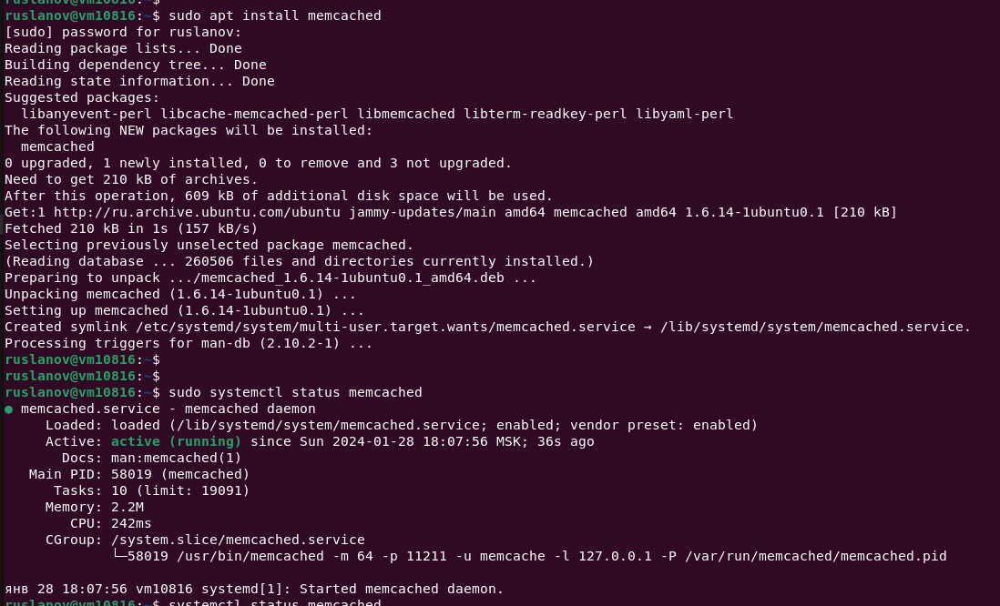
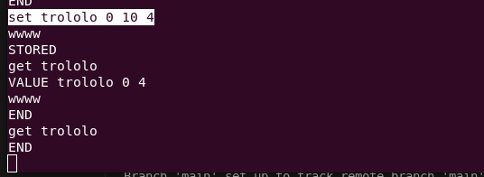
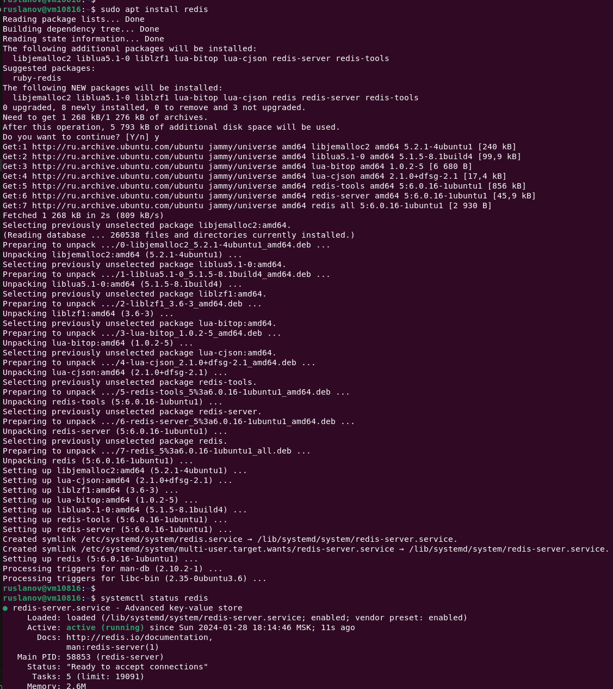
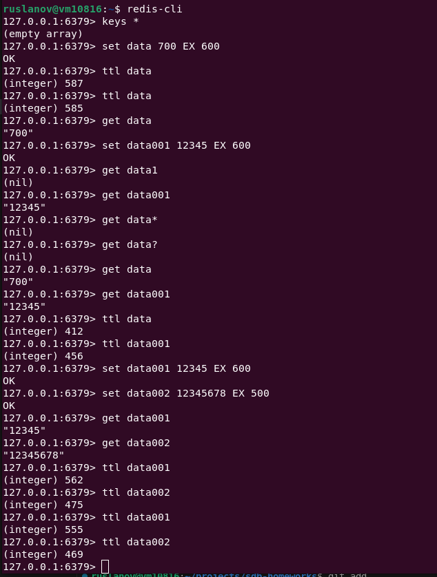
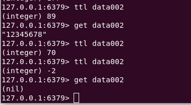
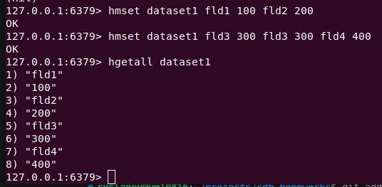
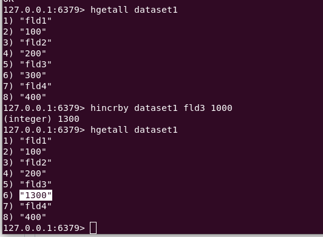

# Домашнее задание к занятию «Кеширование Redis/memcached»

---

### Задание 1. Кеширование 

Приведите примеры проблем, которые может решить кеширование. 

*Приведите ответ в свободной форме.*

> Кэширование — это способ оптимизации работы приложения, при котором данные временно кладутся в промежуточный буфер с быстрым доступом.

- **Повышение производительности** достигается за счет складывания в кэш данных, к которым чаще всего происходит обращение;
- **Увеличение скорости ответа** приложений, сервисов
- **Экономия ресурсов базы данных**, кэширование тяжелых запросов;
- **Сглаживание бустов трафика**, резкое увеличение трафика.

---

### Задание 2. Memcached

Установите и запустите memcached.

*Приведите скриншот systemctl status memcached, где будет видно, что memcached запущен.*

```
apt install memcached
systemctl status memcached
```



---

### Задание 3. Удаление по TTL в Memcached

Запишите в memcached несколько ключей с любыми именами и значениями, для которых выставлен TTL 5. 

*Приведите скриншот, на котором видно, что спустя 5 секунд ключи удалились из базы.*

> Приводится команда создания ключа для 10 секунд, тк за 5 секунд невозможно получить провежуточное значение

`set trololo 0 10 4`



---

### Задание 4. Запись данных в Redis

Запишите в Redis несколько ключей с любыми и значениями. 

*Через redis-cli достаньте все записанные ключи и значения из базы, приведите скриншот этой операции.*



> Записываем и создаем ключи при помощи ***redis-cli***



> Ключ **data002** с закончившимся ttl



> Создадим хеш таблицу

`hmset dataset1 fld1 100 fld2 200`



## Дополнительные задания (со звёздочкой*)
Эти задания дополнительные, то есть не обязательные к выполнению, и никак не повлияют на получение вами зачёта по этому домашнему заданию. Вы можете их выполнить, если хотите глубже разобраться в материале.

### Задание 5*. Работа с числами 

Запишите в Redis ключ key5 со значением типа "int" равным числу 5. Увеличьте его на 5, чтобы в итоге в значении лежало число 10.  

*Приведите скриншот, где будут проделаны все операции и будет видно, что значение key5 стало равно 10.*

> Инкрементируем одно из полей **fld3** созданной хеш таблицы

`hincrby dataset1 fld3 1000`


