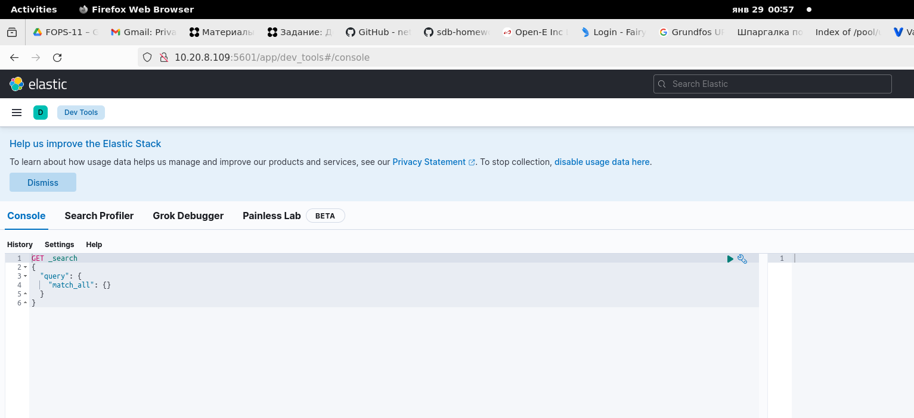

# Домашнее задание к занятию «ELK»

### Задание 1. Elasticsearch 

Установите и запустите Elasticsearch, после чего поменяйте параметр cluster_name на случайный. 

*Приведите скриншот команды 'curl -X GET 'localhost:9200/_cluster/health?pretty', сделанной на сервере с установленным Elasticsearch. Где будет виден нестандартный cluster_name*.

> Устанавливаем **elasticsearch**

```
apt update && apt install gnupg apt-transport-https # <--зависимости
wget -qO - https://artifacts.elastic.co/GPG-KEY-elasticsearch | sudo apt-key add - # <--добавляем gpg-ключ
echo "deb [trusted=yes] https://mirror.yandex.ru/mirrors/elastic/7/ stable main" | sudo tee /etc/apt/sources.list.d/elastic-7.x.list #<--добавляем репозиторий в apt
apt update && apt-get install elasticsearch # <--устанавливаем elastic
systemctl daemon-reload # <--обновляем конфиги systemd
systemctl enable elasticsearch.service # <--включаем юнит
systemctl start elasticsearch.service # <--запускаем сервис
```


> Меняем настройки в **/etc/elasticsearch/elasticsearch.yml**

```
cluster.name: netology-logging           #<--меняем имя кластера
node.name: node-1                        #<--меняем название ноды, если нужно
node.roles: [ master, data, ingest ]     #<--какую функцию будет выполнять эта нода
cluster.initial_master_nodes: ["node-1"] #<--узлы, участвующие в голосовании по выбору мастера
discovery.seed_hosts: ["ip-адрес"]       #<--список возможных мастеров кластера
path.data: /var/lib/elasticsearch        #<-где храним данные
path.logs: /var/log/elasticsearch        #<--куда пишем логи
network.host: 0.0.0.0                    #<--какой ip слушает хост
```

> Проверяем, что сервер запустился

`curl 'localhost:9200/_cluster/health?pretty'`


---

### Задание 2. Kibana

Установите и запустите Kibana.

*Приведите скриншот интерфейса Kibana на странице http://<ip вашего сервера>:5601/app/dev_tools#/console, где будет выполнен запрос GET /_cluster/health?pretty*.

> Устанавливаем Kibana

```
apt install kibana              #<--установка
systemctl daemon-reload         #<--обновляем конфиги systemd
systemctl enable kibana.service #<--включаем юнит
systemctl start kibana.service  #<--запускаем сервис
```


> Настройки в **/etc/kibana/kibana.yml**

`server.host: "0.0.0.0" <--открываем интерфейс в мир`

> Проверка запуска службы 


> Web нтерфейс Kibana



> Web нтерфейс Kibana, выполнение запроса GET /_cluster/health?pretty


---

### Задание 3. Logstash

Установите и запустите Logstash и Nginx. С помощью Logstash отправьте access-лог Nginx в Elasticsearch. 

*Приведите скриншот интерфейса Kibana, на котором видны логи Nginx.*

> Устанавливаем Logstash

```
apt install logstash               #<--установка
systemctl daemon-reload            #<--обновляем конфиги systemd
systemctl enable logstash.service  #<--включаем юнит
systemctl start logstash.service   #<--запускаем сервис
```
> Добавляем правила обработки логов, создаем файлы с правилами обрботки **/etc/logstash/conf.d** (механизм pipeline). Можно все правила поместить в один файл например **/etc/logstash/logstash.conf**

Файл /etc/logstash/conf.d/input.conf

```
input {
  file {
    path => "/var/log/nginx/access.log"
    start_position => "beginning"
  }
}
```

Файл /etc/logstash/conf.d/filter.conf

```
filter {
  grok {
    match => { "message" => "%{IPORHOST:remote_ip} - %{DATA:user_name}
    \[%{HTTPDATE:access_time}\] \"%{WORD:http_method} %{DATA:url}
    HTTP/%{NUMBER:http_version}\" %{NUMBER:response_code} %{NUMBER:body_sent_bytes}
    \"%{DATA:referrer}\" \"%{DATA:agent}\"" }
  }
  mutate {
    remove_field => [ "host" ]
  }
}
```

Файл /etc/logstash/conf.d/output.conf

```
output {
  elasticsearch {
    hosts => "localhost"
    data_stream => "true"
  }
}
```


> Проверка статуса сервиса

`systemctl status logstash.service`


> Интерфейс Kibana, с данными из логов Nginx


---

### Задание 4. Filebeat. 

Установите и запустите Filebeat. Переключите поставку логов Nginx с Logstash на Filebeat. 

*Приведите скриншот интерфейса Kibana, на котором видны логи Nginx, которые были отправлены через Filebeat.*

> Устанавливаем Filebeat

```
apt install filebeat               #<--установка
systemctl daemon-reload            #<--обновляем конфиги systemd
systemctl enable filebeat.service  #<--включаем юнит
systemctl start filebeat.service   #<--запускаем сервис
```

> Настроим поставку access-лога nginx в elasticsearch с помощью модуля:

```
filebeat setup --dashboards  #<--создает дашборды в kibana
filebeat modules list        #<--смотрим список установленных модулей
```

> Включаем модуль **nginx**

`filebeat modules enable nginx`


> Выключаем модуль system, для уменьшения объема передаваемых логов

`filebeat modules disable system`


> меняем конфиг **/etc/filebeat/filebeat.yml**

```
filebeat.inputs:
  - type: log
    enabled: true
    paths:
      - /var/log/nginx/access.log

output.elasticsearch:
  hosts: ["localhost:9200"]
```

> Перезапуск и статус службы filebeat

```
systemctl restart filebeat
systemctl status filebeat
```


> Cкриншот интерфейса Kibana, логи Nginx, отправленые через Filebeat.


## Дополнительные задания (со звёздочкой*)
Эти задания дополнительные, то есть не обязательные к выполнению, и никак не повлияют на получение вами зачёта по этому домашнему заданию. Вы можете их выполнить, если хотите глубже шире разобраться в материале.

### Задание 5*. Доставка данных 

Настройте поставку лога в Elasticsearch через Logstash и Filebeat любого другого сервиса , но не Nginx. 
Для этого лог должен писаться на файловую систему, Logstash должен корректно его распарсить и разложить на поля. 

*Приведите скриншот интерфейса Kibana, на котором будет виден этот лог и напишите лог какого приложения отправляется.*

## Дополнительные ресурсы

При выполнении задания используйте дополнительные ресурсы:
- [docker-compose elasticsearch + kibana](11-03/docker-compose.yaml);
- [поднимаем elk в docker](https://www.elastic.co/guide/en/elasticsearch/reference/7.17/docker.html);
- [поднимаем elk в docker с filebeat и docker-логами](https://www.sarulabs.com/post/5/2019-08-12/sending-docker-logs-to-elasticsearch-and-kibana-with-filebeat.html);
- [конфигурируем logstash](https://www.elastic.co/guide/en/logstash/7.17/configuration.html);
- [плагины filter для logstash](https://www.elastic.co/guide/en/logstash/current/filter-plugins.html);
- [конфигурируем filebeat](https://www.elastic.co/guide/en/beats/libbeat/5.3/config-file-format.html);
- [привязываем индексы из elastic в kibana](https://www.elastic.co/guide/en/kibana/7.17/index-patterns.html);
- [как просматривать логи в kibana](https://www.elastic.co/guide/en/kibana/current/discover.html);
- [решение ошибки increase vm.max_map_count elasticsearch](https://stackoverflow.com/questions/42889241/how-to-increase-vm-max-map-count).

**Примечание**: если у вас недоступны официальные образы, можете найти альтернативные варианты в DockerHub, например, [такой](https://hub.docker.com/layers/bitnami/elasticsearch/7.17.13/images/sha256-8084adf6fa1cf24368337d7f62292081db721f4f05dcb01561a7c7e66806cc41?context=explore).

