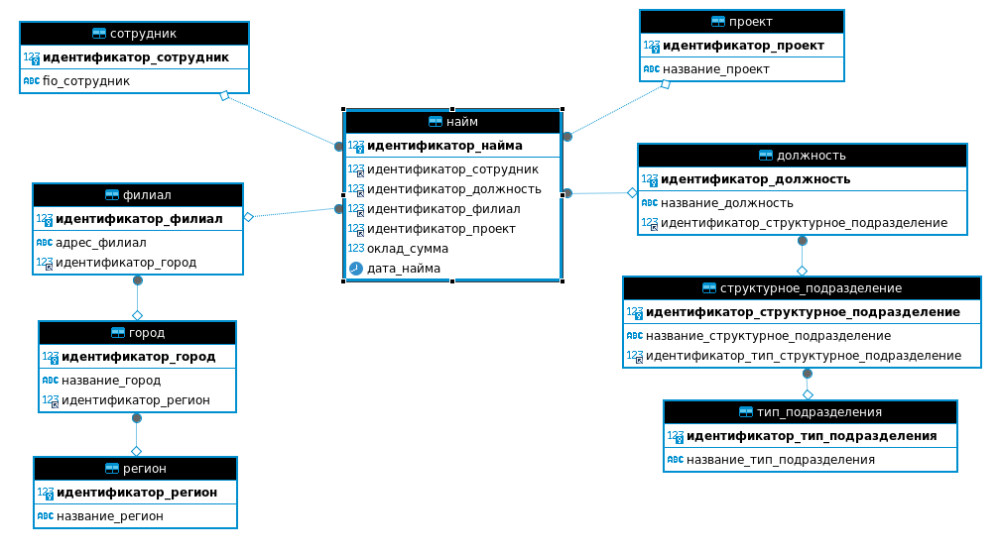

# Домашнее задание к занятию «Базы данных»

### Легенда

Заказчик передал вам [файл в формате Excel](https://github.com/netology-code/sdb-homeworks/blob/main/resources/hw-12-1.xlsx), в котором сформирован отчёт. 

На основе этого отчёта нужно выполнить следующие задания.

### Задание 1

Опишите не менее семи таблиц, из которых состоит база данных:

- какие данные хранятся в этих таблицах;
- какой тип данных у столбцов в этих таблицах, если данные хранятся в PostgreSQL.

Приведите решение к следующему виду:

Сотрудники (

- идентификатор, первичный ключ, serial,
- фамилия varchar(50),
- ...
- идентификатор структурного подразделения, внешний ключ, integer).

#### Ответ после исправлений

```
Таблица `тип_подразделения` (
  `идентификатор_тип_подразделения` первичный ключ, serial,
  `название_тип_подразделения` varchar(100),
)

Таблица `структурное_подразделение` (
  `идентификатор_структурное_подразделение` первичный ключ, serial,
  `название_структурное_подразделение` varchar(100),
  `идентификатор_тип_структурное_подразделение` integer внешний ключ Таблица `тип_подразделения`.`идентификатор_тип_подразделения`
)

Таблица `должность` (
  `идентификатор_должность` первичный ключ, serial,
  `название_должность` varchar(100),
  `идентификатор_структурное_подразделение` integer внешний ключ Таблица `структурное_подразделение`.`идентификатор_структурное_подразделение`
)

Таблица `регион` (
  `идентификатор_регион` первичный ключ, serial,
  `название_регион` varchar(100),
)

Таблица `город` (
  `идентификатор_город` первичный ключ, serial,
  `название_город` varchar(100),
  `идентификатор_регион` integer внешний ключ Таблица `регион`.`идентификатор_регион`
)

Таблица `филиал` (
  `идентификатор_филиал` первичный ключ, serial,
  `адрес_филиал` varchar(100),
  `идентификатор_город` integer внешний ключ Таблица `город`.`идентификатор_город`
)

Таблица `сотрудник` (
  `идентификатор_сотрудник` первичный ключ, serial,
  `fio_сотрудник` varchar(100),
)

Таблица `проект` (
  `идентификатор_проект` первичный ключ, serial,
  `название_проект` varchar(100),
)

Таблица `найм` (
  `идентификатор_найма` первичный ключ, serial, 
  `идентификатор_сотрудник` integer внешний ключ Таблица `сотрудник`.`идентификатор_сотрудник`,
  `идентификатор_должность` integer внешний ключ Таблица `должность`.`идентификатор_должность`,
  `идентификатор_филиал` integer внешний ключ Таблица `филиал`.`идентификатор_филиал`,
  `идентификатор_проект` integer внешний ключ Таблица `проект`.`идентификатор_проект`,
  `оклад_сумма` decimal(10,0),
  `дата_найма` datetime,
)
```

> Графическое представление



> Ответ (первая версия) ОТКЛОНЕН

**Таблица_1 должности** (

- идентификатор_должности, первичный ключ, serial,
- название должности varchar(50),

)

**Таблица_2 тип_подразделения** (

- идентификатор_типа_подразделения, первичный ключ, serial,
- название_типа_подразделения varchar(50),

)

**Таблица_3 стуртурное_подразделение** (

- идентификатор_структурного_подразделения, первичный ключ, serial,
- название_структурного_подразделения varchar(50),

)

**Таблица_4 адреса_филиалов** (

- идентификатор_адреса, первичный ключ, serial,
- адрес varchar(255),

)

**Таблица_5 проекты** (

- идентификатор_проекта, первичный ключ, serial,
- название_проекта varchar(50),

)

**Таблица_6 сотрудники** (

- идентификатор_сотрудника, первичный ключ, serial,
- фамилия varchar(50),
- имя varchar(50),
- отчество varchar(50)

)

**Таблица_7 реестр_сотрудников** (

- идентификатор_записи_реестра, первичный ключ, serial,
- дата_записи_реестра, datetime,                                        # можно эту дату использовать как дату найма, но можно добавить и отдельное поле Дата найма
- оклад, integer,
- идентификатор_сотрудника, внешний ключ, integer,
- идентификатор_должности, внешний ключ, integer,
- идентификатор_типа_подразделения, внешний ключ, integer,
- идентификатор_структурного_подразделения, внешний ключ, integer,
- идентификатор_адреса, внешний ключ, integer,
- идентификатор_проекта, внешний ключ, integer,

)


## Дополнительные задания (со звёздочкой*)
Эти задания дополнительные, то есть не обязательные к выполнению, и никак не повлияют на получение вами зачёта по этому домашнему заданию. Вы можете их выполнить, если хотите глубже шире разобраться в материале.


### Задание 2*

Перечислите, какие, на ваш взгляд, в этой денормализованной таблице встречаются функциональные зависимости и какие правила вывода нужно применить, чтобы нормализовать данные.
