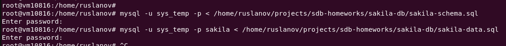
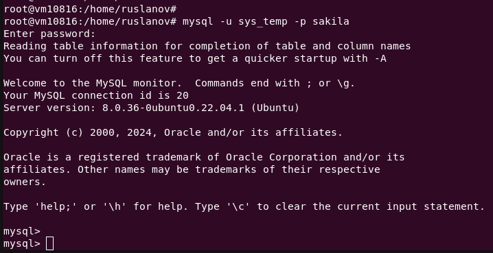
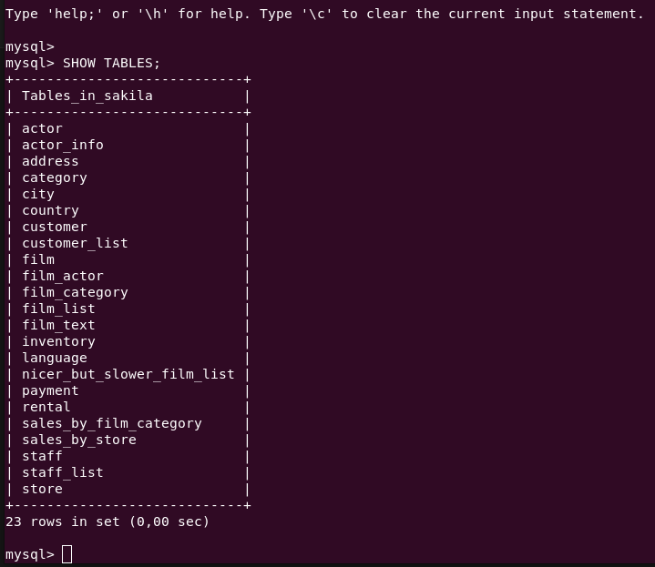
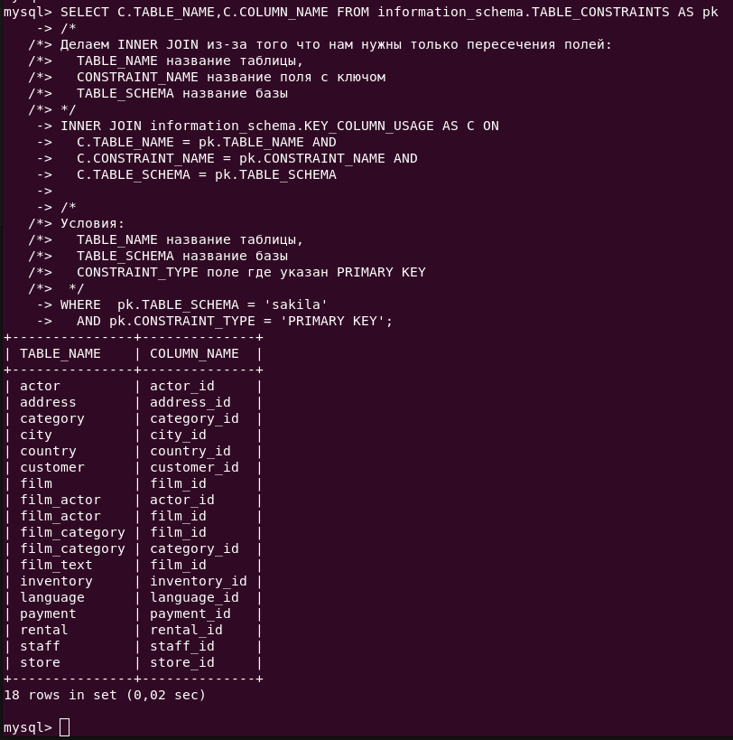

# Домашнее задание к занятию «Работа с данными (DDL/DML)»

---

Задание можно выполнить как в любом IDE, так и в командной строке.

### Задание 1
1.1. Поднимите чистый инстанс MySQL версии 8.0+. Можно использовать локальный сервер или контейнер Docker.

> Устанавливаем mysql сервер из репозитория

```
sudo apt update
sudo apt install mysql-server
```


1.2. Создайте учётную запись sys_temp. 

```sql
CREATE USER 'sys_temp'@'localhost' IDENTIFIED BY 'password';
```

1.3. Выполните запрос на получение списка пользователей в базе данных. (скриншот)

```sql
SELECT user,authentication_string,plugin,host FROM mysql.user;
```


1.4. Дайте все права для пользователя sys_temp. 

```sql
GRANT ALL PRIVILEGES ON *.* TO 'sys_temp'@'localhost' WITH GRANT OPTION;
```

1.5. Выполните запрос на получение списка прав для пользователя sys_temp. (скриншот)

```sql
SHOW GRANTS FOR 'sys_temp'@'localhost';
```


1.6. Переподключитесь к базе данных от имени sys_temp.

Для смены типа аутентификации с sha2 используйте запрос: 
```sql
ALTER USER 'sys_temp'@'localhost' IDENTIFIED WITH mysql_native_password BY 'password';
```


> Подключаемся под пользователем **sys_temp**

`mysql -u sys_temp -p`


1.6. По ссылке https://downloads.mysql.com/docs/sakila-db.zip скачайте дамп базы данных.

1.7. Восстановите дамп в базу данных.

> Импортируем схему данных

`mysql -u sys_temp -p < /home/ruslanov/projects/sdb-homeworks/sakila-db/sakila-schema.sql`

> Импортируем данные 

`mysql -u sys_temp -p sakila < /home/ruslanov/projects/sdb-homeworks/sakila-db/sakila-data.sql`



> Подключаемся под пользователем **sys_temp** в базу **sakila**

`mysql -u sys_temp -p sakila`



1.8. При работе в IDE сформируйте ER-диаграмму получившейся базы данных. При работе в командной строке используйте команду для получения всех таблиц базы данных. (скриншот)

> Получаем список всех таблиц

```sql
SHOW TABLES;
```



*Результатом работы должны быть скриншоты обозначенных заданий, а также простыня со всеми запросами.*


### Задание 2
Составьте таблицу, используя любой текстовый редактор или Excel, в которой должно быть два столбца: в первом должны быть названия таблиц восстановленной базы, во втором названия первичных ключей этих таблиц. Пример: (скриншот/текст)
```
Название таблицы | Название первичного ключа
customer         | customer_id
```

> Выполним запрос

```sql
SELECT C.TABLE_NAME,C.COLUMN_NAME FROM information_schema.TABLE_CONSTRAINTS AS pk
/*
Делаем INNER JOIN из-за того что нам нужны только пересечения полей:
  TABLE_NAME название таблицы,
  CONSTRAINT_NAME название поля с ключом 
  TABLE_SCHEMA название базы
*/
INNER JOIN information_schema.KEY_COLUMN_USAGE AS C ON
  C.TABLE_NAME = pk.TABLE_NAME AND
  C.CONSTRAINT_NAME = pk.CONSTRAINT_NAME AND
  C.TABLE_SCHEMA = pk.TABLE_SCHEMA
/* 
Условия:
  TABLE_SCHEMA название базы
  CONSTRAINT_TYPE поле где указан PRIMARY KEY
 */
WHERE  pk.TABLE_SCHEMA = 'sakila'
  AND pk.CONSTRAINT_TYPE = 'PRIMARY KEY';

```



> Результат в текстовом виде

```
| Название таблицы | Название первичного ключа |
| actor            | actor_id                  |
| address          | address_id                |
| category         | category_id               |
| city             | city_id                   |
| country          | country_id                |
| customer         | customer_id               |
| film             | film_id                   |
| film_actor       | actor_id                  |
| film_actor       | film_id                   |
| film_category    | film_id                   |
| film_category    | category_id               |
| film_text        | film_id                   |
| inventory        | inventory_id              |
| language         | language_id               |
| payment          | payment_id                |
| rental           | rental_id                 |
| staff            | staff_id                  |
| store            | store_id                  |
```

## Дополнительные задания (со звёздочкой*)
Эти задания дополнительные, то есть не обязательные к выполнению, и никак не повлияют на получение вами зачёта по этому домашнему заданию. Вы можете их выполнить, если хотите глубже шире разобраться в материале.

### Задание 3*
3.1. Уберите у пользователя sys_temp права на внесение, изменение и удаление данных из базы sakila.

3.2. Выполните запрос на получение списка прав для пользователя sys_temp. (скриншот)

*Результатом работы должны быть скриншоты обозначенных заданий, а также простыня со всеми запросами.*
