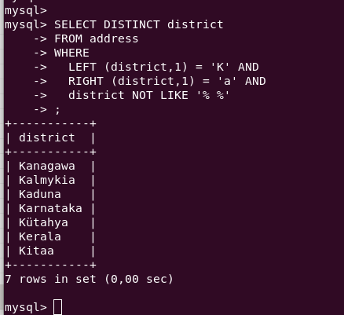
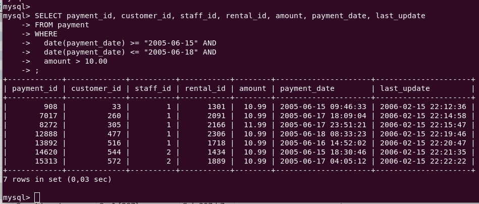
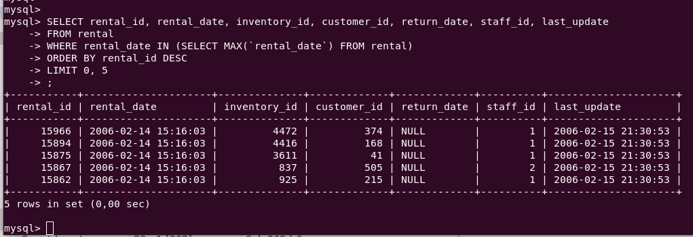
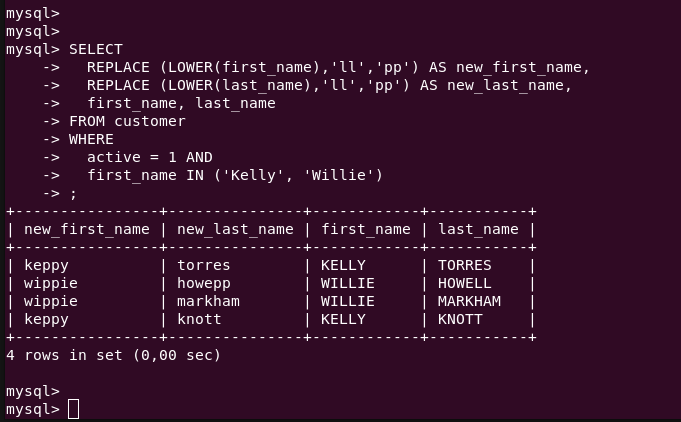

# Домашнее задание к занятию «SQL. Часть 1»

---

Задание можно выполнить как в любом IDE, так и в командной строке.

### Задание 1

Получите уникальные названия районов из таблицы с адресами, которые начинаются на “K” и заканчиваются на “a” и не содержат пробелов.

```sql
SELECT DISTINCT district
FROM address
WHERE
  LEFT (district,1) = 'K' AND
  RIGHT (district,1) = 'a'AND
  district NOT LIKE '% %'
;
```



### Задание 2

Получите из таблицы платежей за прокат фильмов информацию по платежам, которые выполнялись в промежуток с 15 июня 2005 года по 18 июня 2005 года **включительно** и стоимость которых превышает 10.00.

```sql
SELECT payment_id, customer_id, staff_id, rental_id, amount, payment_date, last_update
FROM payment
WHERE
  date(payment_date) >= "2005-06-15" AND
  date(payment_date) <= "2005-06-18" AND
  amount > 10.00
;
```



### Задание 3

Получите последние пять аренд фильмов.

```sql
SELECT rental_id, rental_date, inventory_id, customer_id, return_date, staff_id, last_update
FROM rental
WHERE rental_date IN (SELECT MAX(`rental_date`) FROM rental)
ORDER BY rental_id DESC
LIMIT 0, 5
;
```



### Задание 4

Одним запросом получите активных покупателей, имена которых Kelly или Willie. 

Сформируйте вывод в результат таким образом:
- все буквы в фамилии и имени из верхнего регистра переведите в нижний регистр,
- замените буквы 'll' в именах на 'pp'.

```sql
SELECT 
  REPLACE (LOWER(first_name),'ll','pp') AS new_first_name, 
  REPLACE (LOWER(last_name),'ll','pp') AS new_last_name,
  first_name, last_name
FROM customer
WHERE
  active = 1 AND 
  first_name IN ('Kelly', 'Willie')
;
```



## Дополнительные задания (со звёздочкой*)
Эти задания дополнительные, то есть не обязательные к выполнению, и никак не повлияют на получение вами зачёта по этому домашнему заданию. Вы можете их выполнить, если хотите глубже шире разобраться в материале.

### Задание 5*

Выведите Email каждого покупателя, разделив значение Email на две отдельных колонки: в первой колонке должно быть значение, указанное до @, во второй — значение, указанное после @.

### Задание 6*

Доработайте запрос из предыдущего задания, скорректируйте значения в новых колонках: первая буква должна быть заглавной, остальные — строчными.
