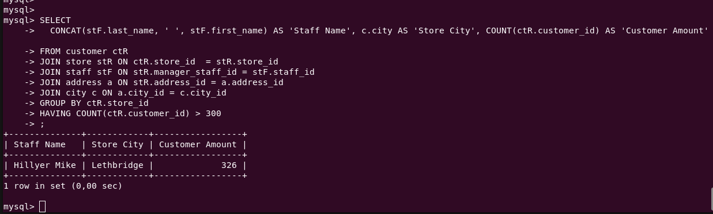

# Домашнее задание к занятию «SQL. Часть 2»

---

Задание можно выполнить как в любом IDE, так и в командной строке.

### Задание 1

Одним запросом получите информацию о магазине, в котором обслуживается более 300 покупателей, и выведите в результат следующую информацию: 
- фамилия и имя сотрудника из этого магазина;
- город нахождения магазина;
- количество пользователей, закреплённых в этом магазине.

```sql
SELECT
  CONCAT(stF.last_name, ' ', stF.first_name) AS 'Staff Name', c.city AS 'Store City', COUNT(ctR.customer_id) AS 'Customer Amount'
FROM customer ctR
JOIN store stR ON ctR.store_id  = stR.store_id  
JOIN staff stF ON stR.manager_staff_id = stF.staff_id 
JOIN address a ON stR.address_id = a.address_id 
JOIN city c ON a.city_id = c.city_id  
GROUP BY ctR.store_id 
HAVING COUNT(ctR.customer_id) > 300
;
```



### Задание 2

Получите количество фильмов, продолжительность которых больше средней продолжительности всех фильмов.

### Задание 3

Получите информацию, за какой месяц была получена наибольшая сумма платежей, и добавьте информацию по количеству аренд за этот месяц.

## Дополнительные задания (со звёздочкой*)
Эти задания дополнительные, то есть не обязательные к выполнению, и никак не повлияют на получение вами зачёта по этому домашнему заданию. Вы можете их выполнить, если хотите глубже шире разобраться в материале.

### Задание 4*

Посчитайте количество продаж, выполненных каждым продавцом. Добавьте вычисляемую колонку «Премия». Если количество продаж превышает 8000, то значение в колонке будет «Да», иначе должно быть значение «Нет».

### Задание 5*

Найдите фильмы, которые ни разу не брали в аренду.
