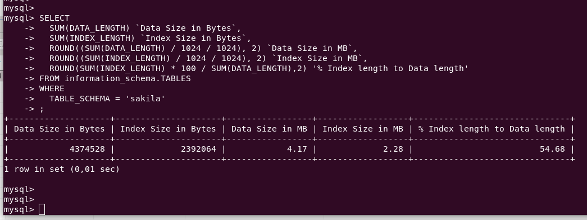

# Домашнее задание к занятию «Индексы»

### Задание 1

Напишите запрос к учебной базе данных, который вернёт процентное отношение общего размера всех индексов к общему размеру всех таблиц.

```sql
SELECT 
  SUM(DATA_LENGTH) `Data Size in Bytes`,
  SUM(INDEX_LENGTH) `Index Size in Bytes`,
  ROUND((SUM(DATA_LENGTH) / 1024 / 1024), 2) `Data Size in MB`,
  ROUND((SUM(INDEX_LENGTH) / 1024 / 1024), 2) `Index Size in MB`,
  ROUND(SUM(INDEX_LENGTH) * 100 / SUM(DATA_LENGTH),2) '% Index length to Data length'
FROM information_schema.TABLES
WHERE 
  TABLE_SCHEMA = 'sakila'
;
```



### Задание 2

Выполните explain analyze следующего запроса:
```sql
select distinct concat(c.last_name, ' ', c.first_name), sum(p.amount) over (partition by c.customer_id, f.title)
from payment p, rental r, customer c, inventory i, film f
where date(p.payment_date) = '2005-07-30' and p.payment_date = r.rental_date and r.customer_id = c.customer_id and i.inventory_id = r.inventory_id
```
- перечислите узкие места;
- оптимизируйте запрос: внесите корректировки по использованию операторов, при необходимости добавьте индексы.

### Ответ

```sql
/* ИСХОДНЫЙ КОД */
explain analyze
select distinct concat(c.last_name, ' ', c.first_name), sum(p.amount) over (partition by c.customer_id, f.title)
from payment p, rental r, customer c, inventory i, film f
where date(p.payment_date) = '2005-07-30' and p.payment_date = r.rental_date and r.customer_id = c.customer_id and i.inventory_id = r.inventory_id
;

-> Table scan on <temporary>  (cost=2.5..2.5 rows=0) (actual time=10827..10827 rows=391 loops=1)
    -> Temporary table with deduplication  (cost=0..0 rows=0) (actual time=10827..10827 rows=391 loops=1)
    	/* ОБРАЩЕНИЕ К ТАБЛИЦЕ film дает плохие результаты */
        -> Window aggregate with buffering: sum(payment.amount) OVER (PARTITION BY c.customer_id,f.title )   (actual time=4435..10330 rows=642000 loops=1)
            -> Sort: c.customer_id, f.title  (actual time=4435..4590 rows=642000 loops=1)
                -> Stream results  (cost=10.5e+6 rows=16.1e+6) (actual time=1.04..3242 rows=642000 loops=1)
                    -> Nested loop inner join  (cost=10.5e+6 rows=16.1e+6) (actual time=1.02..2745 rows=642000 loops=1)
                        -> Nested loop inner join  (cost=8.85e+6 rows=16.1e+6) (actual time=1.01..2493 rows=642000 loops=1)
                            -> Nested loop inner join  (cost=7.24e+6 rows=16.1e+6) (actual time=0.994..2168 rows=642000 loops=1)
                                -> Inner hash join (no condition)  (cost=1.61e+6 rows=16.1e+6) (actual time=0.959..84.6 rows=634000 loops=1)
                                    /* СКАНИРОВАНИЕ И ФИЛЬТРАЦИЮ payments нельзя исключить это основные данные что мы собираем */
                                    -> Filter: (cast(p.payment_date as date) = '2005-07-30')  (cost=1.68 rows=16086) (actual time=0.0901..9.26 rows=634 loops=1)
                                        -> Table scan on p  (cost=1.68 rows=16086) (actual time=0.0653..6.47 rows=16044 loops=1)
                                    -> Hash
                                        /* ОБРАЩЕНИЕ К ТАБЛИЦЕ film cost 103 */
                                        -> Covering index scan on f using idx_title  (cost=103 rows=1000) (actual time=0.113..0.67 rows=1000 loops=1)
                                -> Covering index lookup on r using rental_date (rental_date=p.payment_date)  (cost=0.25 rows=1) (actual time=0.00214..0.0031 rows=1.01 loops=634000)
                            -> Single-row index lookup on c using PRIMARY (customer_id=r.customer_id)  (cost=250e-6 rows=1) (actual time=310e-6..333e-6 rows=1 loops=642000)
                        -> Single-row covering index lookup on i using PRIMARY (inventory_id=r.inventory_id)  (cost=250e-6 rows=1) (actual time=176e-6..208e-6 rows=1 loops=642000)


/* ПЕРВАЯ ИТЕРАЦИЯ Убираем таблицу film */
explain analyze
select distinct concat(c.last_name, ' ', c.first_name), sum(p.amount) /* over (partition by c.customer_id, f.title) */
from payment p, rental r, customer c, inventory i /*, film f */
where date(p.payment_date) = '2005-07-30' and p.payment_date = r.rental_date and r.customer_id = c.customer_id and i.inventory_id = r.inventory_id
group by concat(c.last_name, ' ', c.first_name)
;

-> Table scan on <temporary>  (actual time=33.7..34.1 rows=391 loops=1)
    -> Aggregate using temporary table  (actual time=33.7..33.7 rows=391 loops=1)
        -> Nested loop inner join  (cost=18536 rows=16102) (actual time=0.209..30.5 rows=642 loops=1)
            -> Nested loop inner join  (cost=12900 rows=16102) (actual time=0.2..28 rows=642 loops=1)
                -> Nested loop inner join  (cost=7265 rows=16102) (actual time=0.185..25.7 rows=642 loops=1)
                    -> Filter: (cast(p.payment_date as date) = '2005-07-30')  (cost=1633 rows=16086) (actual time=0.144..19.8 rows=634 loops=1)
                        -> Table scan on p  (cost=1633 rows=16086) (actual time=0.099..16.1 rows=16044 loops=1)
                    -> Covering index lookup on r using rental_date (rental_date=p.payment_date)  (cost=0.25 rows=1) (actual time=0.00603..0.00889 rows=1.01 loops=634)
                -> Single-row index lookup on c using PRIMARY (customer_id=r.customer_id)  (cost=0.25 rows=1) (actual time=0.00306..0.00312 rows=1 loops=642)
            -> Single-row covering index lookup on i using PRIMARY (inventory_id=r.inventory_id)  (cost=0.25 rows=1) (actual time=0.00336..0.00343 rows=1 loops=642)
            
            

/* Убираем таблицу inventory */            
explain analyze
select distinct concat(c.last_name, ' ', c.first_name), sum(p.amount) /* over (partition by c.customer_id, f.title) */
from payment p, rental r, customer c /*, inventory i , film f */
where date(p.payment_date) = '2005-07-30' and p.payment_date = r.rental_date and r.customer_id = c.customer_id /* and i.inventory_id = r.inventory_id */
group by concat(c.last_name, ' ', c.first_name)
;            

-> Table scan on <temporary>  (actual time=19.3..19.4 rows=391 loops=1)
    -> Aggregate using temporary table  (actual time=19.3..19.3 rows=391 loops=1)
        -> Nested loop inner join  (cost=12900 rows=16102) (actual time=0.148..17.2 rows=642 loops=1)
            -> Nested loop inner join  (cost=7265 rows=16102) (actual time=0.135..15.5 rows=642 loops=1)
                -> Filter: (cast(p.payment_date as date) = '2005-07-30')  (cost=1633 rows=16086) (actual time=0.104..11.4 rows=634 loops=1)
                    -> Table scan on p  (cost=1633 rows=16086) (actual time=0.0838..8.72 rows=16044 loops=1)
                -> Covering index lookup on r using rental_date (rental_date=p.payment_date)  (cost=0.25 rows=1) (actual time=0.0042..0.0062 rows=1.01 loops=634)
            -> Single-row index lookup on c using PRIMARY (customer_id=r.customer_id)  (cost=0.25 rows=1) (actual time=0.00221..0.00226 rows=1 loops=642)


/* Пробуем создать  Индекс на поле payment_date таблицы payment */
CREATE INDEX payment_payment_date_IDX USING BTREE ON sakila.payment (payment_date);
            
explain analyze
select concat(c.last_name, ' ', c.first_name), sum(p.amount) /* over (partition by c.customer_id, f.title) */
from payment p, rental r, customer c /*, inventory i , film f */
where date(p.payment_date) = '2005-07-30' and p.payment_date = r.rental_date and r.customer_id = c.customer_id /* and i.inventory_id = r.inventory_id */
group by concat(c.last_name, ' ', c.first_name)
;  

-> Table scan on <temporary>  (actual time=155..156 rows=391 loops=1)
    -> Aggregate using temporary table  (actual time=155..155 rows=391 loops=1)
        -> Nested loop inner join  (cost=11238 rows=16102) (actual time=1.25..149 rows=642 loops=1)
            -> Nested loop inner join  (cost=5602 rows=15831) (actual time=0.53..56.7 rows=16044 loops=1)
                -> Table scan on c  (cost=61.2 rows=599) (actual time=0.0952..0.905 rows=599 loops=1)
                -> Index lookup on r using idx_fk_customer_id (customer_id=c.customer_id)  (cost=6.61 rows=26.4) (actual time=0.0778..0.0908 rows=26.8 loops=599)
            -> Index lookup on p using payment_payment_date_IDX (payment_date=r.rental_date), with index condition: (cast(p.payment_date as date) = '2005-07-30')  (cost=0.254 rows=1.02) (actual time=0.00544..0.0055 rows=0.04 loops=16044)

    
```

### Выводы

Два послених результата с Индексом и Без индекса сопоставимы. Скорее всего наличие индекса положительно проявит себя на больших объемах данных в таблице платежей

## Дополнительные задания (со звёздочкой*)
Эти задания дополнительные, то есть не обязательные к выполнению, и никак не повлияют на получение вами зачёта по этому домашнему заданию. Вы можете их выполнить, если хотите глубже шире разобраться в материале.

### Задание 3*

Самостоятельно изучите, какие типы индексов используются в PostgreSQL. Перечислите те индексы, которые используются в PostgreSQL, а в MySQL — нет.

*Приведите ответ в свободной форме.*
