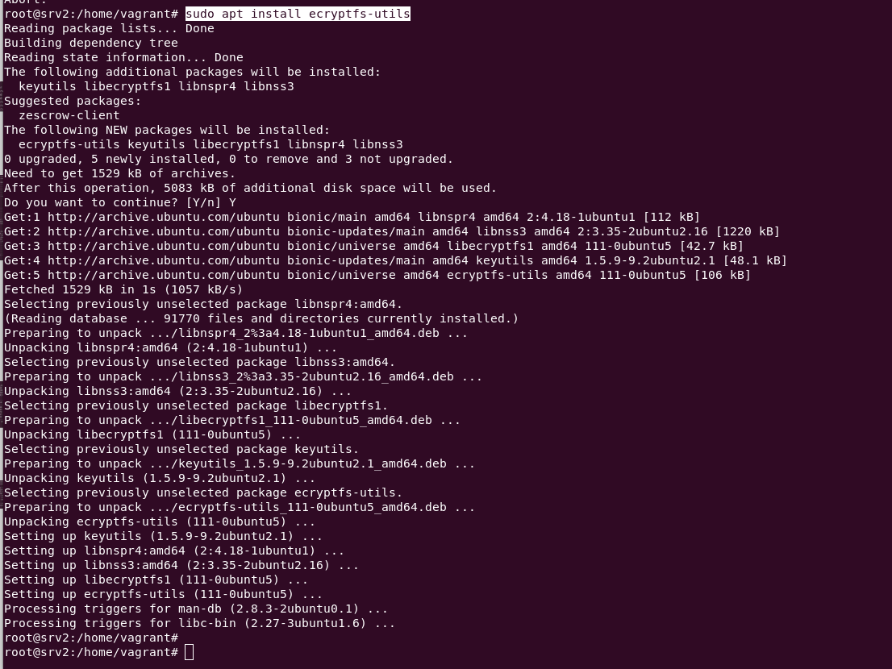
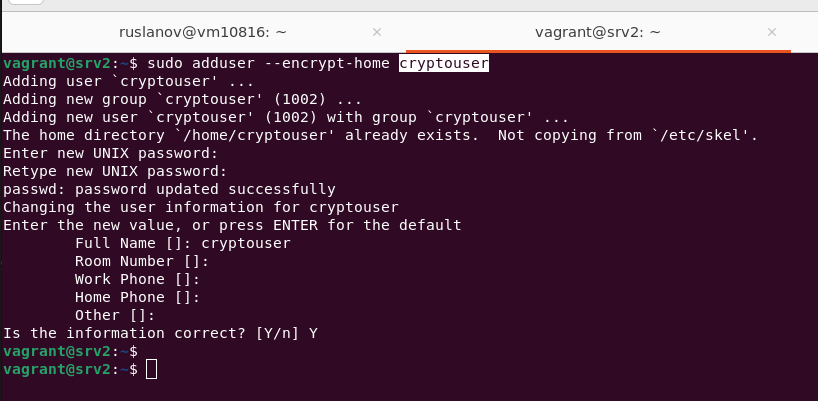
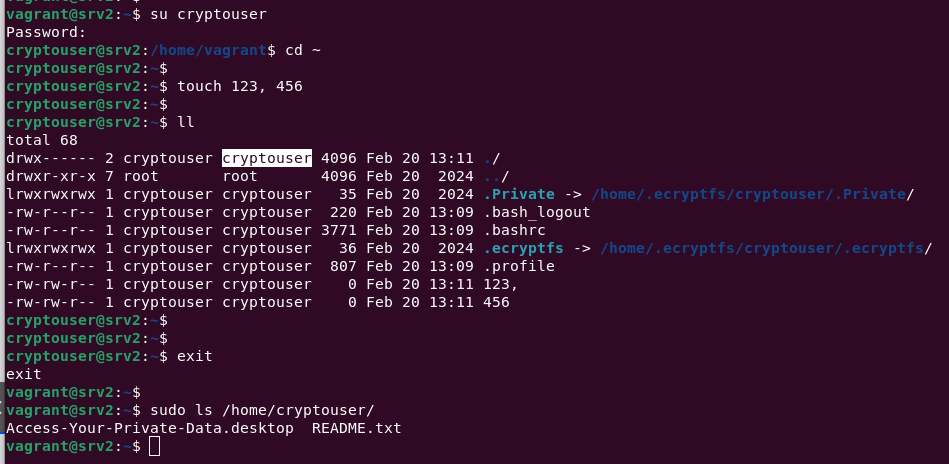

# Домашнее задание к занятию  «Защита хоста»

### Задание 1

1. Установите **eCryptfs**.

`sudo apt install ecryptfs-utils`



2. Добавьте пользователя cryptouser.
3. Зашифруйте домашний каталог пользователя с помощью eCryptfs.

`sudo adduser --encrypt-home cryptouser`



*В качестве ответа  пришлите снимки экрана домашнего каталога пользователя с исходными и зашифрованными данными.*  

```bash
vagrant@srv2:~$ 
vagrant@srv2:~$ su cryptouser
Password: 
cryptouser@srv2:/home/vagrant$ cd ~
cryptouser@srv2:~$ 
cryptouser@srv2:~$ touch 123, 456
cryptouser@srv2:~$ 
cryptouser@srv2:~$ ll
total 68
drwx------ 2 cryptouser cryptouser 4096 Feb 20 13:11 ./
drwxr-xr-x 7 root       root       4096 Feb 20  2024 ../
lrwxrwxrwx 1 cryptouser cryptouser   35 Feb 20  2024 .Private -> /home/.ecryptfs/cryptouser/.Private/
-rw-r--r-- 1 cryptouser cryptouser  220 Feb 20 13:09 .bash_logout
-rw-r--r-- 1 cryptouser cryptouser 3771 Feb 20 13:09 .bashrc
lrwxrwxrwx 1 cryptouser cryptouser   36 Feb 20  2024 .ecryptfs -> /home/.ecryptfs/cryptouser/.ecryptfs/
-rw-r--r-- 1 cryptouser cryptouser  807 Feb 20 13:09 .profile
-rw-rw-r-- 1 cryptouser cryptouser    0 Feb 20 13:11 123,
-rw-rw-r-- 1 cryptouser cryptouser    0 Feb 20 13:11 456
cryptouser@srv2:~$ 
cryptouser@srv2:~$ 
cryptouser@srv2:~$ exit
exit
vagrant@srv2:~$ 
vagrant@srv2:~$ sudo ls /home/cryptouser/
Access-Your-Private-Data.desktop  README.txt
vagrant@srv2:~$ 
```



### Задание 2

1. Установите поддержку **LUKS**.
2. Создайте небольшой раздел, например, 100 Мб.
3. Зашифруйте созданный раздел с помощью LUKS.

*В качестве ответа пришлите снимки экрана с поэтапным выполнением задания.*


## Дополнительные задания (со звёздочкой*)

Эти задания дополнительные, то есть не обязательные к выполнению, и никак не повлияют на получение вами зачёта по этому домашнему заданию. Вы можете их выполнить, если хотите глубже шире разобраться в материале

### Задание 3 *

1. Установите **apparmor**.
2. Повторите эксперимент, указанный в лекции.
3. Отключите (удалите) apparmor.


*В качестве ответа пришлите снимки экрана с поэтапным выполнением задания.*


