# Домашнее задание к занятию «Защита сети»

### Подготовка к выполнению заданий

1. Подготовка защищаемой системы:

- установите **Suricata**,

> Установка Suricata на ОС Debian 

```bash
sudo apt install software-properties-common
sudo apt update
```
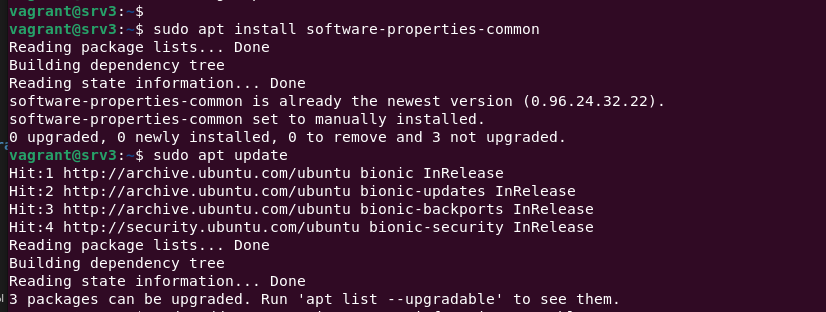

```bash
sudo add-apt-repository ppa:oisf/suricata-stable
```

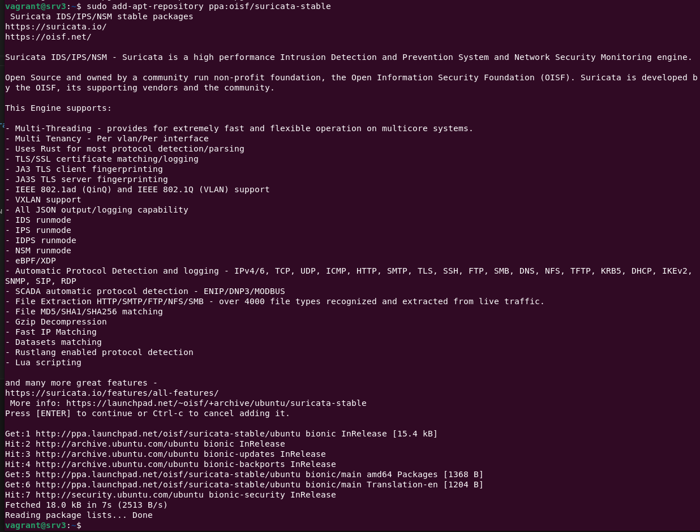

```bash
sudo apt install suricata
```

> Обновление базы сигнатур

`sudo suricata-update`

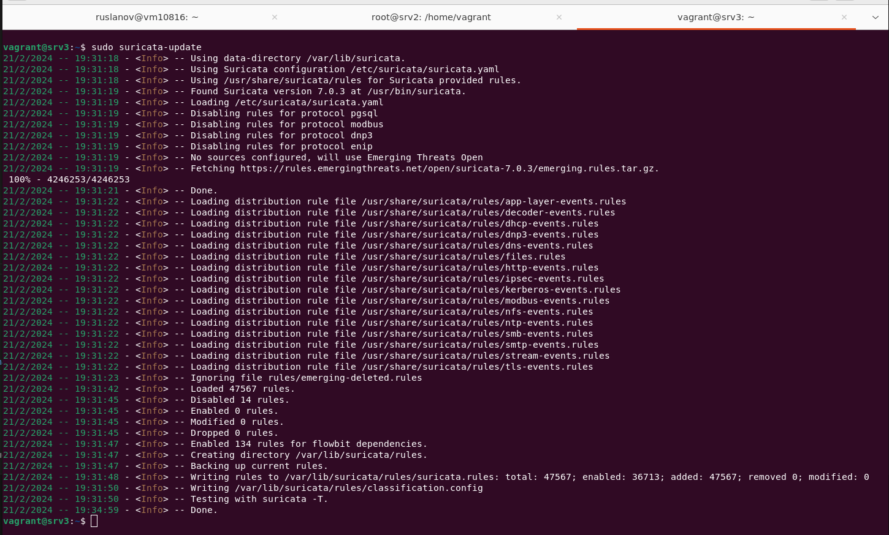

> Проверка установки

`sudo systemctl status suricata`

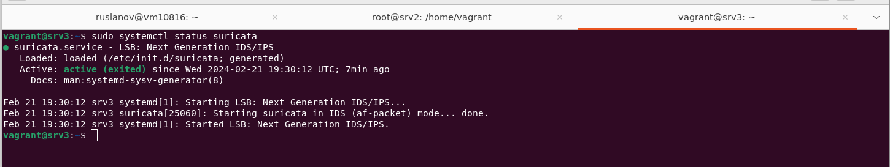

> Вносим изменения в конфигурационный файл

`sudo nano /etc/suricata/suricata.yaml`

```bash
EXTERNAL_NET: “any”

af-packet:
interface: enp0s8

default-rule-path: /var/lib/suricata/rules
rule-files:
- suricata.rules
```

> Рестарт и проверка запуска

```bash
sudo systemctl restart suricata
sudo systemctl status suricata
```

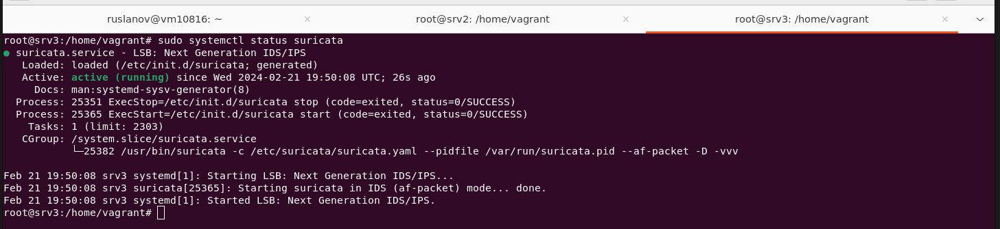

> Лог-файлы Suricata

```bash
sudo tail /var/log/suricata/suricata.log
sudo tail /var/log/suricata/stats.log
```

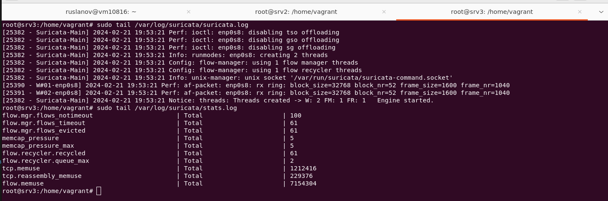

> Запуск Suricata на конкретном сетевом интерфейсе (параметр i указывает прослушиваемый интерфейс)

`sudo suricata -c /etc/suricata/suricata.yaml -i enp0s8`

- установите **Fail2Ban**.

> Выполним установку Fail2ban на атакуемую машину

```bash
sudo apt install fail2ban
sudo systemctl status fail2ban
```

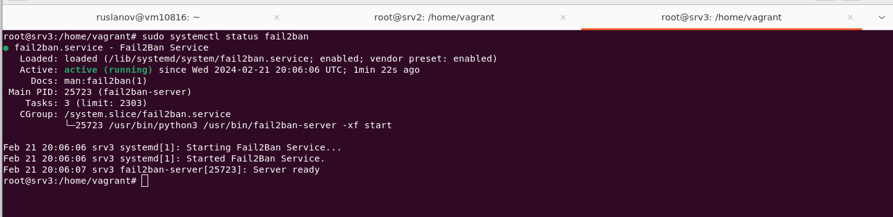

2. Подготовка системы злоумышленника: установите **nmap** и **thc-hydra** либо скачайте и установите **Kali linux**.

> nmap

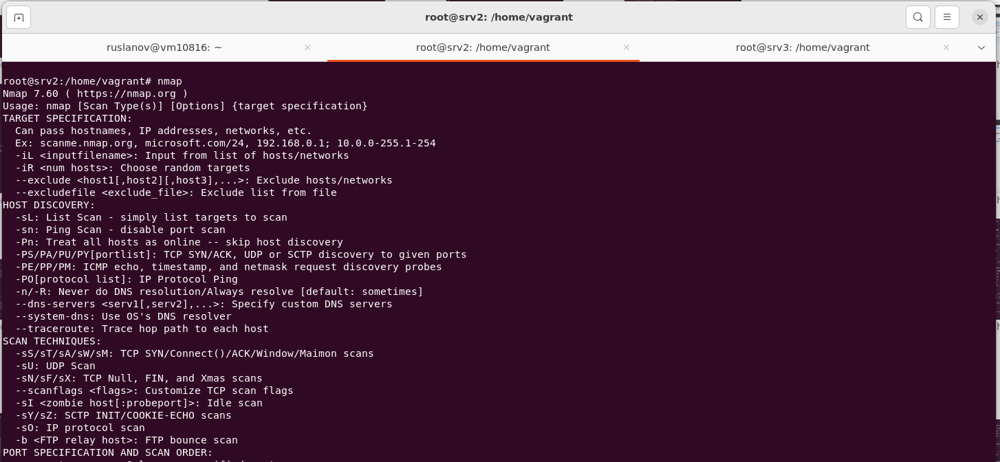

> hydra

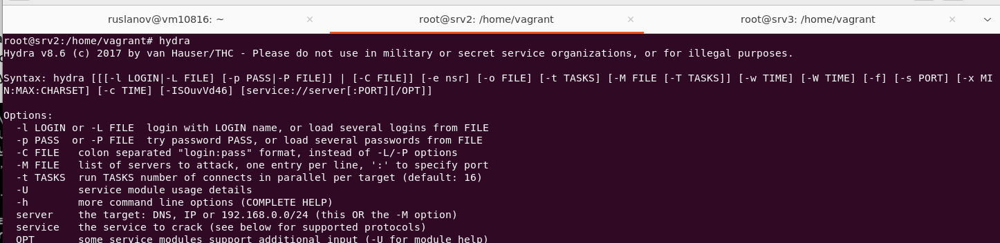

Обе системы должны находится в одной подсети.

------

### Задание 1

Проведите разведку системы и определите, какие сетевые службы запущены на защищаемой системе:

Атакующий:  srv2 (10.20.8.107)
Зашищаемый: srv3 (10.20.8.108)

**sudo nmap -sA < ip-адрес >**

`sudo nmap -sA 10.20.8.108`

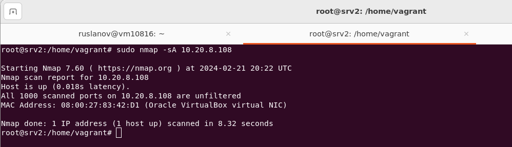

> Результат выполнения команды в обоих логах пусто активности в логе suricata и fail2ban не зафиксированно

**sudo nmap -sT < ip-адрес >**

`sudo nmap -sT 10.20.8.108`

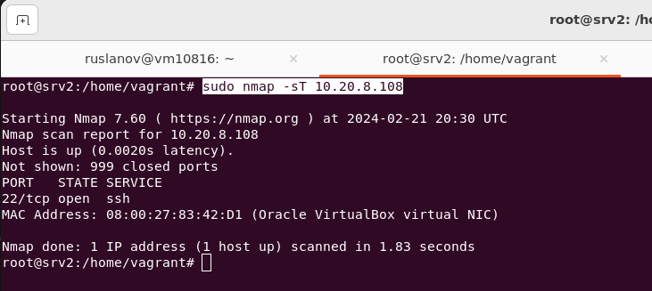

> Вывод лога suricata. Выявлены попытки сканирования стандартных портов и диапазонов. Лог fail2ban пусто без изменений, тк не затронут процесс авторизации

`sudo tail -f /var/log/suricata/fast.log`

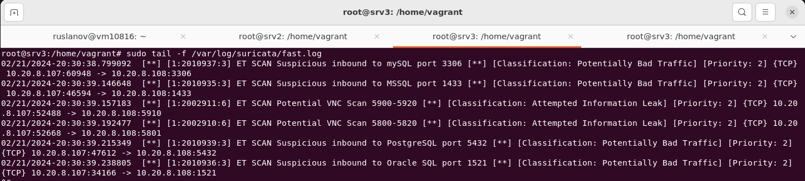

**sudo nmap -sS < ip-адрес >**

`sudo nmap -sS 10.20.8.108`

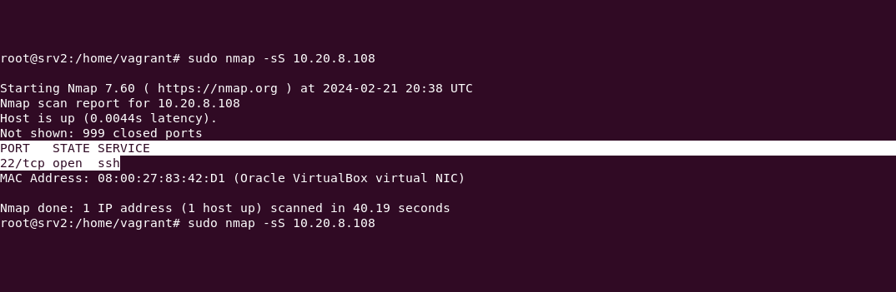

> Вывод лога suricata. Выявлены попытки сканирования стандартных портов и диапазонов, аналогично команде в ключами **-sT**. Лог fail2ban пусто без изменений, тк не затронут процесс авторизации

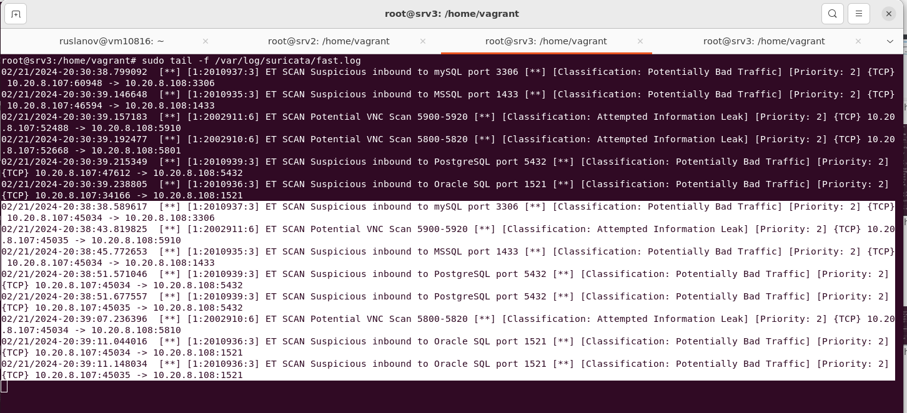

**sudo nmap -sV < ip-адрес >**

`sudo nmap -sV 10.20.8.108`

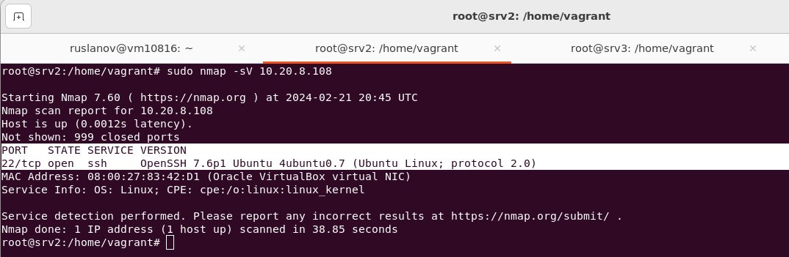

> Вывод лога suricata. Выявлены попытки сканирования стандартных портов и диапазонов, аналогично команде в ключами **-sT**. Лог fail2ban пусто без изменений, тк не затронут процесс авторизации

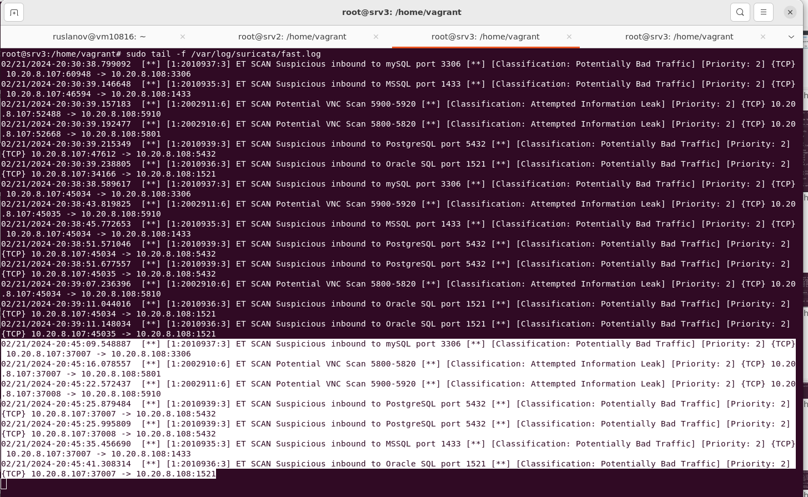


По желанию можете поэкспериментировать с опциями: https://nmap.org/man/ru/man-briefoptions.html.

*В качестве ответа пришлите события, которые попали в логи Suricata и Fail2Ban, прокомментируйте результат.*

------

### Задание 2

Проведите атаку на подбор пароля для службы SSH:

**hydra -L users.txt -P pass.txt < ip-адрес > ssh**

1. Настройка **hydra**: 
 
 - создайте два файла: **users.txt** и **pass.txt**;
 - в каждой строчке первого файла должны быть имена пользователей, второго — пароли. В нашем случае это могут быть случайные строки, но ради эксперимента можете добавить имя и пароль существующего пользователя.

Дополнительная информация по **hydra**: https://kali.tools/?p=1847.

2. Включение защиты SSH для Fail2Ban:

-  открыть файл /etc/fail2ban/jail.conf,
-  найти секцию **ssh**,
-  установить **enabled**  в **true**.

Дополнительная информация по **Fail2Ban**:https://putty.org.ru/articles/fail2ban-ssh.html.


*В качестве ответа пришлите события, которые попали в логи Suricata и Fail2Ban, прокомментируйте результат.*
