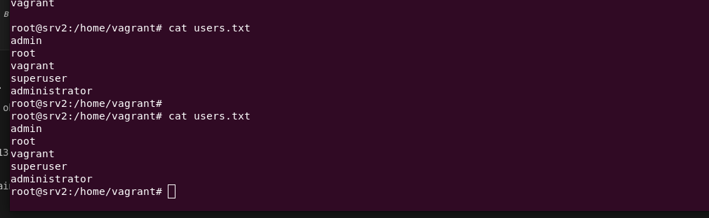
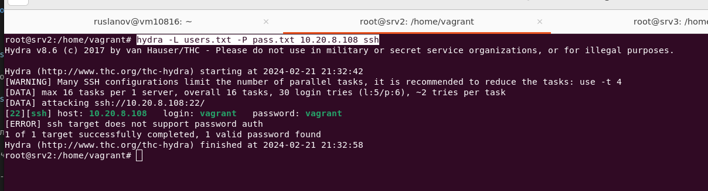
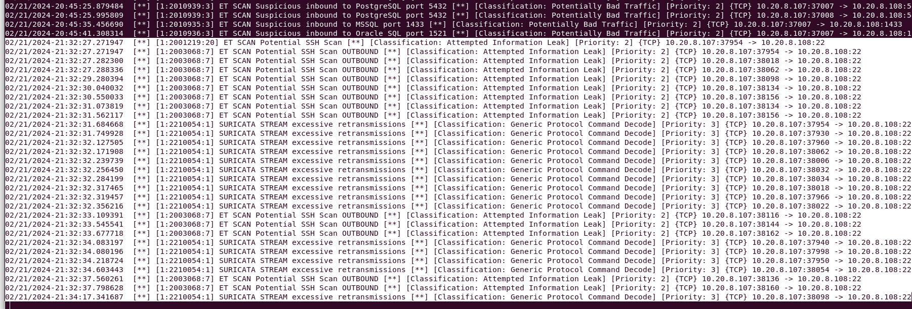
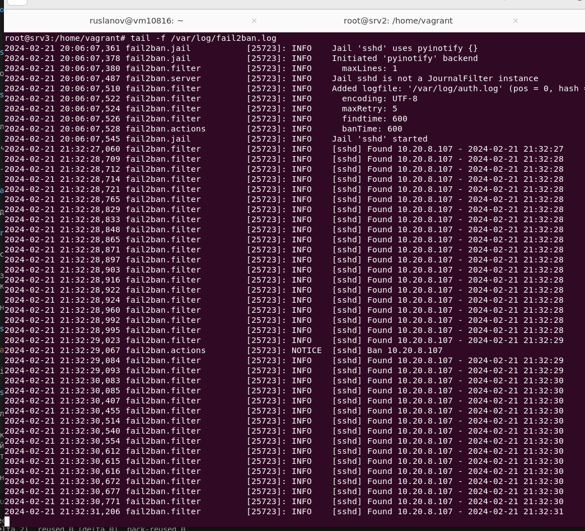
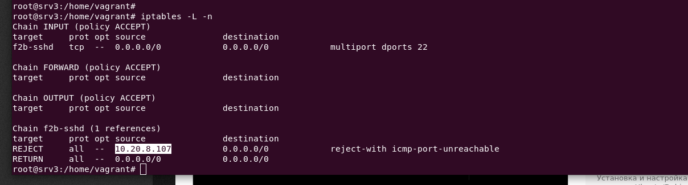

# Домашнее задание к занятию «Защита сети»

### Подготовка к выполнению заданий

1. Подготовка защищаемой системы:

- установите **Suricata**,

> Установка Suricata на ОС Debian 

```bash
sudo apt install software-properties-common
sudo apt update
```


```bash
sudo add-apt-repository ppa:oisf/suricata-stable
```


```bash
sudo apt install suricata
```

> Обновление базы сигнатур

`sudo suricata-update`


> Проверка установки

`sudo systemctl status suricata`


> Вносим изменения в конфигурационный файл

`sudo nano /etc/suricata/suricata.yaml`

```bash
EXTERNAL_NET: “any”

af-packet:
interface: enp0s8

default-rule-path: /var/lib/suricata/rules
rule-files:
- suricata.rules
```

> Рестарт и проверка запуска

```bash
sudo systemctl restart suricata
sudo systemctl status suricata
```


> Лог-файлы Suricata

```bash
sudo tail /var/log/suricata/suricata.log
sudo tail /var/log/suricata/stats.log
```


> Запуск Suricata на конкретном сетевом интерфейсе (параметр i указывает прослушиваемый интерфейс)

`sudo suricata -c /etc/suricata/suricata.yaml -i enp0s8`

- установите **Fail2Ban**.

> Выполним установку Fail2ban на атакуемую машину

```bash
sudo apt install fail2ban
sudo systemctl status fail2ban
```


2. Подготовка системы злоумышленника: установите **nmap** и **thc-hydra** либо скачайте и установите **Kali linux**.

> nmap


> hydra


Обе системы должны находится в одной подсети.

------

### Задание 1

Проведите разведку системы и определите, какие сетевые службы запущены на защищаемой системе:

Атакующий:  srv2 (10.20.8.107)
Зашищаемый: srv3 (10.20.8.108)

**sudo nmap -sA < ip-адрес >**

`sudo nmap -sA 10.20.8.108`

-sA (TCP ACK сканирование). Этот тип сканирования сильно отличается от всех других тем, что он не способен определить открый порт open (или даже открытый|фильтруемый). Он используются для выявления правил брандмауэров, определения учитывают ли он состояние или нет, а также для определения фильтруемых ими портов. Пакет запроса при таком типе сканирования содержит установленным только ACK флаг (если не используется --scanflags). При сканировании нефильтруемых систем, открытые и закрытые порты оба будут возвращать в ответ RST пакет. Nmap помечает их как не фильтруемые, имея ввиду, что они достижимы для ACK пакетов, но неизвестно открыты они или закрыты. Порты, которые не отвечают или посылают в ответ ICMP сообщение об ошибке (тип 3, код 1, 2, 3, 9, 10 или 13), помечаются как фильтруемые.


> Результат выполнения команды влоге suricata пусто, тк данный вид сканирования проверяет достижимость для ASK пакетов, восприняв их за обычную сетевую активность. fail2ban не зафиксированно изменений тк нет процесса авторизации. 

**sudo nmap -sT < ip-адрес >**

`sudo nmap -sT 10.20.8.108`

-sT (TCP сканирование с использованием системного вызова `connect`). Nmap "просит" операционную систему установить соединение с целевой машиной по указанному порту путем системного вызова `connect`. Это такой же высокоуровневый системный вызов, используемый браузерами, P2P клиентами и другими приложениями для установки соединения.


> Вывод лога suricata. Выявлены попытки сканирования стандартных портов и диапазонов. Лог fail2ban пусто без изменений, тк не затронут процесс авторизации

`sudo tail -f /var/log/suricata/fast.log`


**sudo nmap -sS < ip-адрес >**

`sudo nmap -sS 10.20.8.108`

-sS (TCP SYN сканирование). Этот тип сканирования относительно ненавящив и незаметен, т.к. при таком сканировании TCP соединение никогда не устанавливается до конца, но при этом предоставляется ясная и достоверная дифференциация между состояниями `открыт`, `закрыт` и `фильтруется`. Эту технику часто называют сканированием с использованием полуотрытых соединений, т.к. вы не открываете полного TCP соединения. Вы посылаете SYN пакет, как если бы вы хотели установить реальное соединение и ждете. Ответы SYN/ACK указывают на то, что порт прослушивается (открыт), а RST (сброс) на то, что не прослушивается. Если после нескольких запросов не приходит никакого ответа, то порт помечается как фильтруемый. Порт также помечается как фильтруемый, если в ответ приходит ICMP сообщение об ошибке недостижимости (тип 3, код 1,2, 3, 9, 10 или 13).


> Вывод лога suricata. Выявлены попытки сканирования стандартных портов и диапазонов, аналогично команде в ключами **-sT**. Лог fail2ban пусто без изменений, тк не затронут процесс авторизации


**sudo nmap -sV < ip-адрес >**

`sudo nmap -sV 10.20.8.108`


> Вывод лога suricata. Выявлены попытки сканирования стандартных портов и диапазонов, аналогично команде в ключами **-sT**. Лог fail2ban пусто без изменений, тк не затронут процесс авторизации


По желанию можете поэкспериментировать с опциями: https://nmap.org/man/ru/man-briefoptions.html.

*В качестве ответа пришлите события, которые попали в логи Suricata и Fail2Ban, прокомментируйте результат.*

------

### Задание 2

Проведите атаку на подбор пароля для службы SSH:

**hydra -L users.txt -P pass.txt < ip-адрес > ssh**

1. Настройка **hydra**: 
 
 - создайте два файла: **users.txt** и **pass.txt**;
 - в каждой строчке первого файла должны быть имена пользователей, второго — пароли. В нашем случае это могут быть случайные строки, но ради эксперимента можете добавить имя и пароль существующего пользователя.

Дополнительная информация по **hydra**: https://kali.tools/?p=1847.



`hydra -L users.txt -P pass.txt 10.20.8.108 ssh`



> suricata зафиксировал сканирование и передачу инфомации 



> Fail2Ban зафиксировал попытки авторизации и забанил ip адрес атакующего 10.20.8.107



2. Включение защиты SSH для Fail2Ban:

-  открыть файл /etc/fail2ban/jail.conf,
-  найти секцию **ssh**,
-  установить **enabled**  в **true**.

Защита уже была включена при первоначальной установке.  IP адрес 10.20.8.107 был заблокирован при первом выполнении команды подбора паролей

`iptables -L -n`



Дополнительная информация по **Fail2Ban**:https://putty.org.ru/articles/fail2ban-ssh.html.


*В качестве ответа пришлите события, которые попали в логи Suricata и Fail2Ban, прокомментируйте результат.*
